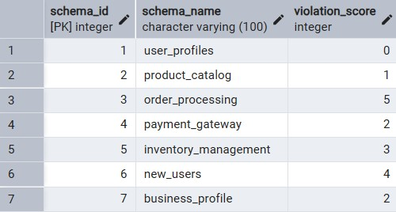
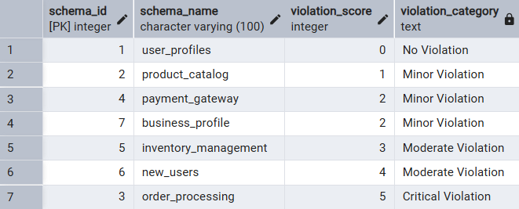
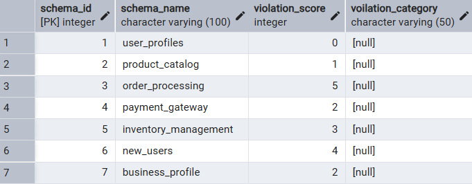
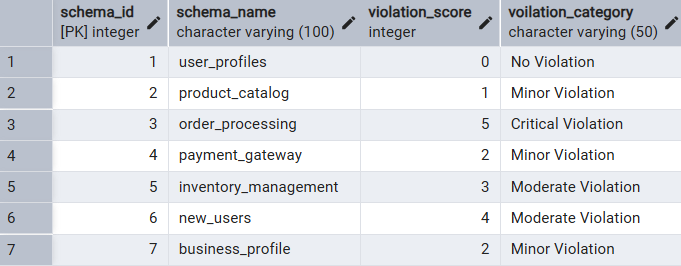
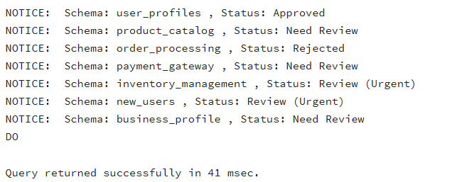
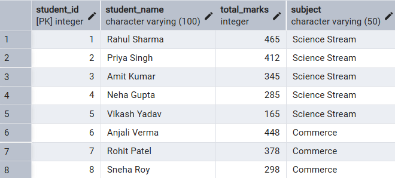
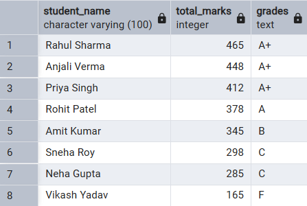
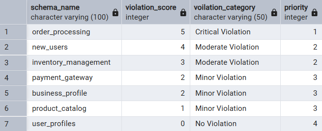

# **TITLE: Technical Training Worksheet 3** 
### Implementation of Conditional Logic using CASE and IF-ELSE in PostgreSQL
---

**Name:** Shubham Agarwal  
**UID:** 25MCI10091 
**Branch:** MCA AI ML  
**Semester:** 2nd  
**Section/Group:** 1A  
**Subject:** Technical Training Lab  
**Date of Performance:** 27/01/2026

---

## Aim of the Session

To implement conditional decision-making logic in PostgreSQL using IF-ELSE constructs and CASE expressions for classification, validation, and rule-based data processing.

---

## Software Requirements

- PostgreSQL Database Server
- pgAdmin 4
- Windows Operating System

---

## Objective of the Session

- To understand conditional execution in SQL
- To implement decision-making logic using CASE expressions
- To simulate real-world rule validation scenarios
- To classify data based on multiple conditions
- To strengthen SQL logic skills required in interviews and backend systems

---

## Practical Experiment Steps

### schema_analysis Table Creation :

```sql
CREATE TABLE schema_analysis (
    schema_id SERIAL PRIMARY KEY,
    schema_name VARCHAR(100) NOT NULL,
    violation_score INT NOT NULL
);

-- Insert data with varying violation scores
INSERT INTO schema_analysis (schema_name, violation_score) VALUES
('user_profiles', 0),
('product_catalog', 1),
('order_processing', 5),
('payment_gateway', 2),
('inventory_management', 3),
('new_users',4),
('business_profile',2);

```


---

### Step 1: Classifying Data Using CASE Expression

**Task:** Retrieve schema names and classify violation levels.

```sql
SELECT 
    schema_id,
    schema_name,
    violation_score,
    CASE 
        WHEN violation_score = 0 THEN 'No Violation'
        WHEN violation_score BETWEEN 1 AND 2 THEN 'Minor Violation'
        WHEN violation_score BETWEEN 3 AND 4 THEN 'Moderate Violation'
        ELSE 'Critical Violation'
    END AS violation_category
FROM schema_analysis
ORDER BY violation_score;

```



---

### Step 2: Applying CASE Logic in Data Updates

**Task:** Add and update approval_status column.

```sql
ALTER TABLE schema_analysis
ADD COLUMN voilation_category varchar(50);
```


---

```sql
UPDATE schema_analysis SET voilation_category = (
 CASE 
        WHEN violation_score = 0 THEN 'No Violation'
        WHEN violation_score BETWEEN 1 AND 2 THEN 'Minor Violation'
        WHEN violation_score BETWEEN 3 AND 4 THEN 'Moderate Violation'
        ELSE 'Critical Violation'
    END
)

SELECT * FROM schema_analysis;
```



---

### Step 3: Implementing IF-ELSE Logic Using PL/pgSQL

**Task:** Direct DO block for violation checking.

```sql
DO $$
DECLARE 
    rec RECORD;
    violation_count INT;
    schema_status VARCHAR(35);
BEGIN
    FOR rec IN SELECT schema_id, schema_name, violation_score FROM schema_analysis LOOP
        violation_count := rec.violation_score;
        
        IF violation_count = 0 THEN
            schema_status := 'Approved';
        ELSIF violation_count BETWEEN 1 AND 2 THEN
            schema_status := 'Need Review';
        ELSIF violation_count BETWEEN 3 AND 4 THEN
            schema_status := 'Review (Urgent)';
        ELSE
            schema_status := 'Rejected';
        END IF;
        
        RAISE NOTICE 'Schema: % , Status: %', 
                     rec.schema_name, schema_status;
    END LOOP;
END $$;
```


---

### Step 4: Real-World Classification - Grading System

### student_grades Table Creation :
```sql

CREATE TABLE student_grades (
    student_id SERIAL PRIMARY KEY,
    student_name VARCHAR(100) NOT NULL,
    total_marks INT NOT NULL CHECK (total_marks >= 0 AND total_marks <= 500),
    subject VARCHAR(50)
);

--record insertion with total_marks range(0-500) -> 5 Subjects

INSERT INTO student_grades (student_name, total_marks, subject) VALUES
('Rahul Sharma', 465, 'Science Stream'),      
('Priya Singh', 412, 'Science Stream'),
('Amit Kumar', 345, 'Science Stream'),        
('Neha Gupta', 285, 'Science Stream'),
('Vikash Yadav', 165, 'Science Stream'),      
('Anjali Verma', 448, 'Commerce'),
('Rohit Patel', 378, 'Commerce'),             
('Sneha Roy', 298, 'Commerce'); 

```


--- 

### Grading Students Based Upon the Total_Marks using CASE statements :
```sql
SELECT 
    student_name,
    total_marks,
    CASE 
        WHEN total_marks >= 400 THEN 'A+'
        WHEN total_marks >= 350 THEN 'A'
        WHEN total_marks >= 300 THEN 'B' 
        WHEN total_marks >= 250 THEN 'C'
        WHEN total_marks >= 200 THEN 'D'
        ELSE 'F'
    END AS grades
FROM student_grades
ORDER BY total_marks DESC;
```


---

### Step 5: CASE for Custom Sorting (Priority)

```sql
SELECT * FROM schema_analysis;
SELECT 
    schema_name,
    violation_score,
	voilation_category,
    CASE 
        WHEN violation_score > 4 THEN 1
        WHEN violation_score BETWEEN 3 and 4 THEN 2
        WHEN violation_score BETWEEN 1 and 2 THEN 3
		ELSE 4
    END AS priority
FROM schema_analysis
ORDER BY priority, violation_score DESC;

```


---

## I/O Analysis

### Input

- schema_analysis table with violation scores(0-5)
- Student grades data (0-500 marks)


### Output

- Violation classification categories
- Approval status updates
- Procedural validation messages
- Student grading system
- Priority-based schema sorting

---

## Learning Outcomes

- learned CASE expressions for data classification
- Implemented procedural IF-ELSE logic in PL/pgSQL
- Automated business rule enforcement through UPDATE CASE
- Developed custom priority sorting for dashboard reporting
- Prepared for SQL interview questions on conditional logic

---

## Repository Contents

- `README_Experiment_3.md` (this file)
- `Experiment_3.sql` (complete code)
- Screenshots (step1.png to step5.png)

```
