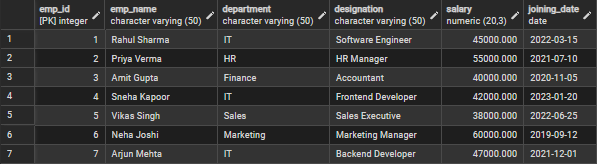
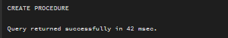
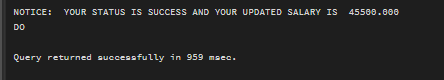

# Experiment No. 8
## Implementation of Stored Procedures in PostgreSQL

> **Student Name:** Shubham Agarwal
> **UID:** 25MCI10091
> **Branch:** MCA (AI & ML)
> **Section/Group:** 25MAM-1/A
> **Semester:** 2nd
> **Date of Performance:** 12/03/2026
> **Subject Name:** Technical Training Lab
> **Subject Code:** 25CAH-653

---

## Aim of the Session

To apply the concept of Stored Procedures in database operations in order to perform tasks like insertion, updating, deletion, and retrieval of data efficiently, securely, and in a reusable manner within the database system.

---

## Software Requirements

- PostgreSQL Database Server
- pgAdmin 4
- Windows Operating System

---

## Objective of the Session

- To understand the concept and usage of stored procedures in database systems.
- To implement stored procedures for performing CRUD operations efficiently.
- To enhance data security by restricting direct access through stored procedures.
- To reduce code redundancy by using reusable database procedures.
- To improve performance of database operations using precompiled stored procedures.

---

## Practical Experiment Steps

### Table Creation

```sql
CREATE TABLE employees (
    emp_id INT PRIMARY KEY,
    emp_name VARCHAR(50),
    department VARCHAR(50),
    designation VARCHAR(50),
    salary NUMERIC(20,3),
    joining_date DATE
);
```

### Record Insertion

```sql
INSERT INTO employees (emp_id, emp_name, department, designation, salary, joining_date) VALUES
(1, 'Rahul Sharma',  'IT',        'Software Engineer',   45000.000, '2022-03-15'),
(2, 'Priya Verma',   'HR',        'HR Manager',          55000.000, '2021-07-10'),
(3, 'Amit Gupta',    'Finance',   'Accountant',          40000.000, '2020-11-05'),
(4, 'Sneha Kapoor',  'IT',        'Frontend Developer',  42000.000, '2023-01-20'),
(5, 'Vikas Singh',   'Sales',     'Sales Executive',     38000.000, '2022-06-25'),
(6, 'Neha Joshi',    'Marketing', 'Marketing Manager',   60000.000, '2019-09-12'),
(7, 'Arjun Mehta',   'IT',        'Backend Developer',   47000.000, '2021-12-01');

SELECT * FROM employees;
```
**Output:**


---

### Step 1: Creating a Stored Procedure

The procedure `update_salary_proc` accepts an employee ID and a salary increment, adds the increment to the existing salary, updates the database, and returns the updated salary along with a status message. If the employee is not found, it raises an exception and returns `EMPLOYEE NOT FOUND`.

```sql
CREATE OR REPLACE PROCEDURE update_salary_proc(
    IN P_EMP_ID INT,
    INOUT P_SALARY NUMERIC(20,3),
    OUT STATUS VARCHAR(20)
)
AS
$$
DECLARE
    CURR_SAL NUMERIC(20,3);
BEGIN
    SELECT SALARY + P_SALARY INTO CURR_SAL
    FROM employees
    WHERE EMP_ID = P_EMP_ID;

    IF NOT FOUND THEN
        RAISE EXCEPTION 'EMPLOYEE NOT FOUND';
    END IF;

    UPDATE employees
    SET salary = CURR_SAL
    WHERE emp_id = P_EMP_ID;

    P_SALARY := CURR_SAL;
    STATUS := 'SUCCESS';

EXCEPTION
    WHEN OTHERS THEN
        IF SQLERRM LIKE '%EMPLOYEE NOT FOUND%' THEN
            STATUS := 'EMPLOYEE NOT FOUND';
        END IF;
END;
$$ LANGUAGE PLPGSQL;
```
**Output:**


---

### Step 2: Calling the Stored Procedure

Calling `update_salary_proc` for `emp_id = 1` with a salary increment of `500`. The procedure updates the salary and prints the result using `RAISE NOTICE`.

```sql
DO
$$
DECLARE
    EMP_ID INT := 1;
    STATUS VARCHAR(20);
    SALARY NUMERIC(20,3) := 500;
BEGIN
    CALL update_salary_proc(EMP_ID, SALARY, STATUS);
    RAISE NOTICE 'YOUR STATUS IS % AND YOUR UPDATED SALARY IS  %', STATUS, SALARY;
END;
$$
```

**Output:**



---

## I/O Analysis

**Input:**
- Employee Data (emp_id, salary increment)

**Output:**
- **Salary Update:** Adds increment to existing salary and updates the database
- **Validation:** Checks if employee exists before performing update
- **Updated Salary:** Returned using `INOUT` parameter
- **Status Message:** Returns `SUCCESS` or `EMPLOYEE NOT FOUND`
- **Error Handling:** Handles exceptions properly via `EXCEPTION` block

---

## Learning Outcomes

- **Stored Procedure Implementation:** Students will be able to create and execute stored procedures using `IN`, `OUT`, and `INOUT` parameters for real-world database operations.
- **Error Handling & Validation:** Students will understand how to implement exception handling in PL/pgSQL to manage invalid inputs and unexpected conditions.
- **Logical Flow Understanding:** Students will gain knowledge of control structures like variable declaration, conditional statements, and query execution inside procedures.
- **Real-world Application:** Students will be able to design systems such as payroll management, employee management, or banking systems where automated updates and validations are required.
