# Hostel Management System

> **Student Name:** Shubham Agarwal
> **UID:** 25MCI10091
> **Branch:** MCA (AI & ML)
> **Section/Group:** 25MAM-1-A
> **Semester:** 2
> **Subject Name:** Technical Training – I
> **Subject Code:** CAP-652
> **Faculty Name :** Mr. Shalabh Bhatiya (E18471)

---

## Abstract

The Hostel Management System is a PostgreSQL-based relational database designed to digitize student hostel operations. It models four core entities — **students**, **rooms**, **allocations**, and **complaints** — with automated occupancy tracking via triggers, referential integrity via foreign keys, and flexible querying via views and stored functions.

---

## Tools Used

- PostgreSQL 14+ / pgAdmin 4
- SQL, PL/pgSQL

---

## Table of Contents

1. [Table Structures & Creation](#1-table-structures--creation)
2. [Constraints, Trigger & Function](#2-constraints-trigger--function)
3. [Data Insertion (INSERT Queries)](#3-data-insertion-insert-queries)
4. [SELECT Queries](#4-select-queries)
5. [UPDATE Queries](#5-update-queries)
6. [DELETE & Other Queries](#6-delete--other-queries)

---

## 1. Table Structures & Creation

### 1.1 Students Table

```sql
CREATE TABLE students (
    student_id SERIAL PRIMARY KEY,
    name VARCHAR(100),
    course VARCHAR(50),
    year INT
);
```


### 1.2 Rooms Table

```sql
CREATE TABLE rooms (
    room_id SERIAL PRIMARY KEY,
    capacity INT,
    occupied INT DEFAULT 0
);
```

### 1.3 Allocation Table

```sql
CREATE TABLE allocation (
    allocation_id SERIAL PRIMARY KEY,
    student_id INT REFERENCES students(student_id),
    room_id INT REFERENCES rooms(room_id),
    allocation_date DATE DEFAULT CURRENT_DATE
);
```

### 1.4 Complaints Table

```sql
CREATE TABLE complaints (
    complaint_id SERIAL PRIMARY KEY,
    student_id INT REFERENCES students(student_id),
    issue TEXT,
    status VARCHAR(20) DEFAULT 'Pending'
);
```

---

## 2. Constraints, Trigger & Function

### 2.1 CHECK Constraint on Rooms

Prevents overbooking — `occupied` can never exceed `capacity`.

```sql
ALTER TABLE rooms
ADD CONSTRAINT check_capacity CHECK (occupied <= capacity);
```

### 2.2 Trigger Function — `update_occupancy()`

Auto-increments `occupied` count in `rooms` whenever a new allocation is inserted.

```sql
CREATE OR REPLACE FUNCTION update_occupancy()
RETURNS TRIGGER AS $$
BEGIN
    UPDATE rooms
    SET occupied = occupied + 1
    WHERE room_id = NEW.room_id;
    RETURN NEW;
END;
$$ LANGUAGE plpgsql;
```

### 2.3 Trigger — `allocate_room_trigger`

Fires AFTER each INSERT on `allocation`, executing `update_occupancy()` per row.

```sql
CREATE TRIGGER allocate_room_trigger
AFTER INSERT ON allocation
FOR EACH ROW
EXECUTE FUNCTION update_occupancy();
```

### 2.4 Stored Function — `get_student_room(sid INT)`

Returns the room ID allocated to a given student.

```sql
CREATE OR REPLACE FUNCTION get_student_room(sid INT)
RETURNS TABLE(room_id INT) AS $$
BEGIN
    RETURN QUERY
    SELECT room_id FROM allocation WHERE student_id = sid;
END;
$$ LANGUAGE plpgsql;
```

### 2.5 View — `available_rooms`

Displays only rooms that still have space.

```sql
CREATE VIEW available_rooms AS
SELECT * FROM rooms
WHERE occupied < capacity;
```

---

## 3. Data Insertion (INSERT Queries)

### 3.1 Students

```sql
INSERT INTO students (name, course, year)
VALUES
('Aman Riyaz',        'BBA',    2),
('Riya Pal',          'BCA',    1),
('Karan Kumar',       'B.Tech', 4),
('Priyanka Chandwani','MCA',    1),
('Sahil Hans',        'MCA',    2),
('Shubham Agarwal',   'MSC',    1),
('Harpreet Kaur',     'B.Tech', 1),
('Navdeep Singh',     'B.Tech', 2),
('Simran Sharma',     'BCA',    2),
('Rohit Verma',       'MBA',    1),
('Manpreet Gill',     'B.Tech', 3),
('Deepika Negi',      'MCA',    2),
('Arjun Malhotra',    'B.Com',  1),
('Jasleen Kaur',      'MBA',    2),
('Vishal Thakur',     'B.Tech', 4),
('Pooja Bhatia',      'MSC',    2);
```
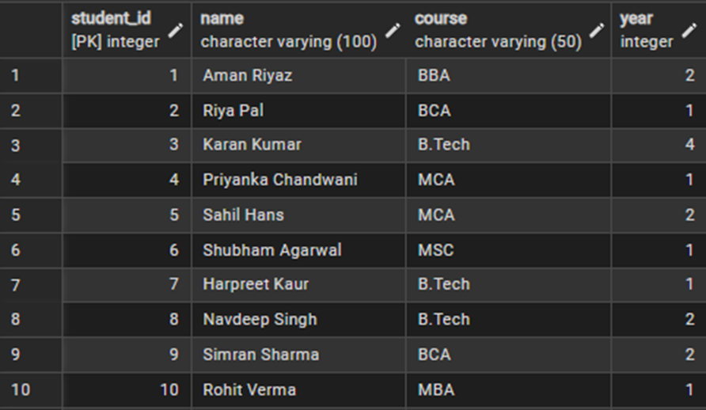
### 3.2 Rooms

```sql
INSERT INTO rooms (capacity, occupied)
VALUES
(2, 0), (3, 0), (4, 0), (2, 0), (3, 0),
(4, 0), (1, 0), (2, 0), (3, 0), (4, 0);
```
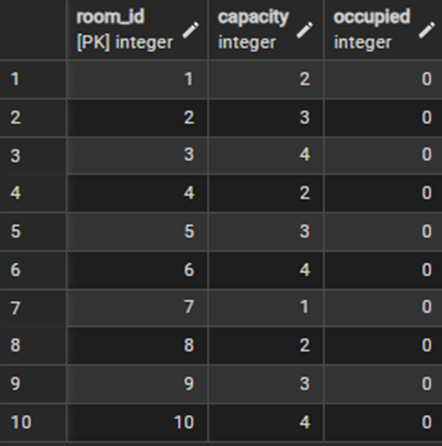
### 3.3 Allocations

```sql
INSERT INTO allocation (student_id, room_id)
VALUES
(1, 1), (2, 3), (3, 2),  (4, 7),  (5, 2),
(6, 5), (7, 3), (8, 6),  (9, 5),  (10, 8),
(11, 6),(12, 9),(13, 4);
```
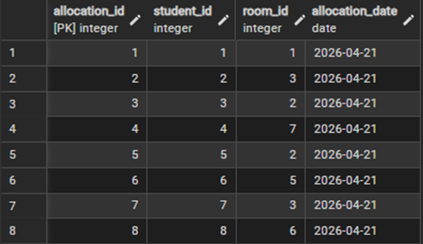
> **Note:** Trigger `allocate_room_trigger` fires automatically for each row, updating `occupied` in the `rooms` table.

### 3.4 Complaints

```sql
INSERT INTO complaints (student_id, issue, status)
VALUES
(1,  'Water supply disrupted in bathroom since 2 days',         'Pending'),
(2,  'Wi-Fi connectivity very slow after 10 PM',                'Pending'),
(3,  'Room window latch broken, security concern',              'Resolved'),
(5,  'Mess food quality has degraded this week',                'Pending'),
(7,  'AC in room not functioning, room temperature unbearable', 'In Progress'),
(8,  'Cockroach infestation noticed near washroom',             'Pending'),
(10, 'Laundry machine on 2nd floor out of order',               'Resolved'),
(11, 'Common room TV remote is missing',                        'Pending'),
(13, 'Power socket near study table not working',               'In Progress'),
(6,  'Noisy neighbour disturbing studies late at night',        'Pending');
```
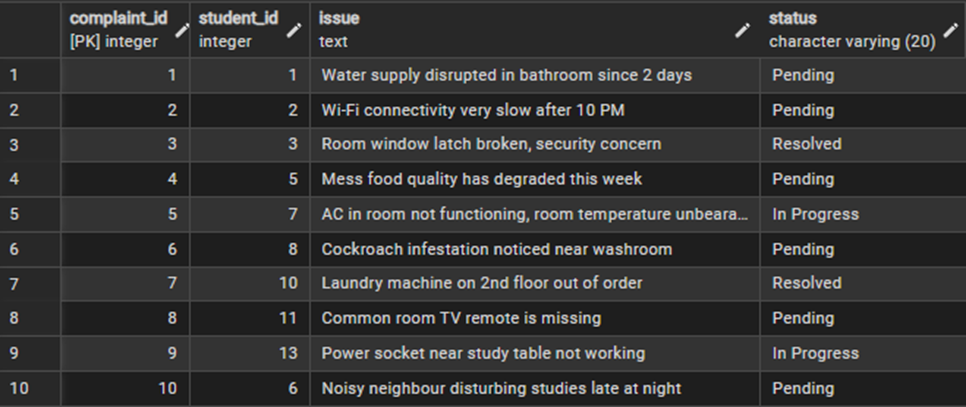
---

## 4. SELECT Queries

### Q1: Students Allocated to Room 1

```sql
SELECT s.name
FROM students s
JOIN allocation a ON s.student_id = a.student_id
WHERE a.room_id = 1;
```
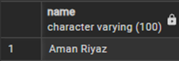
### Q2: Rooms with Available Space

```sql
SELECT * FROM rooms WHERE occupied < capacity;
```
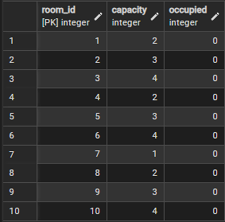
### Q3: All Pending Complaints

```sql
SELECT * FROM complaints WHERE status = 'Pending';
```
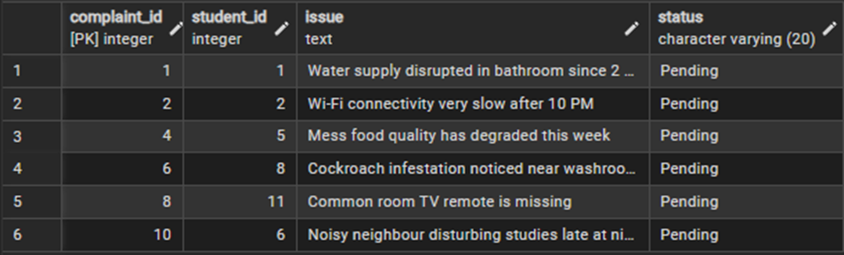
### Q4: All Students Ordered by Course and Year

```sql
SELECT name, course, year
FROM students
ORDER BY course, year;
```
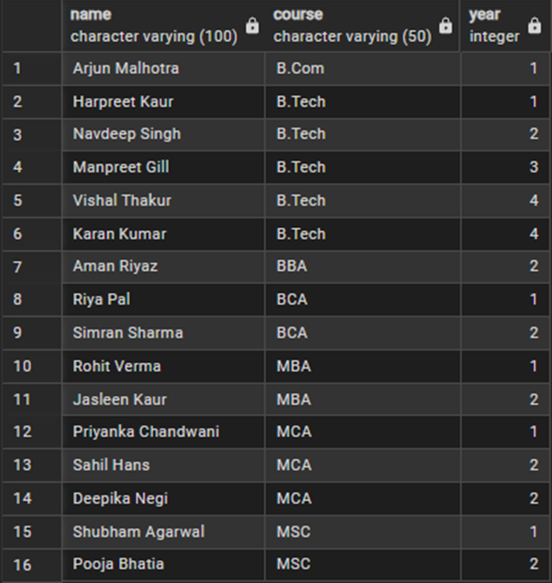

### Q5: Final Year B.Tech Students

```sql
SELECT name, course, year
FROM students
WHERE year > 3 AND course = 'B.Tech';
```
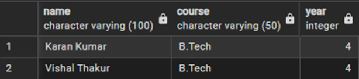


---

## 5. UPDATE Queries

### Q1: Mark a Specific Complaint as Resolved

```sql
UPDATE complaints
SET status = 'Resolved'
WHERE complaint_id = 1;
```
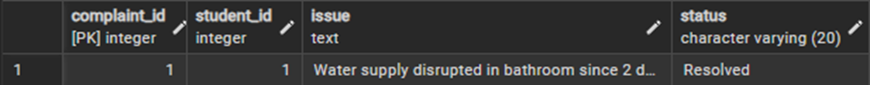
### Q2: Bulk Resolve All 'In Progress' Complaints

```sql
UPDATE complaints
SET status = 'Resolved'
WHERE status = 'In Progress';
```
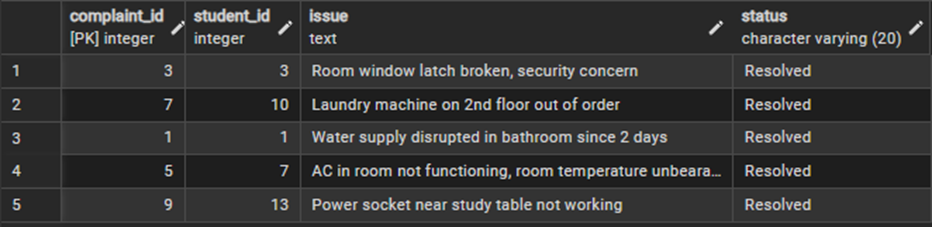

---

## 6. DELETE & Other Queries

### Q1: Remove a Resolved Complaint (Safe Delete)

```sql
DELETE FROM complaints
WHERE complaint_id = 1 AND status = 'Resolved';
```
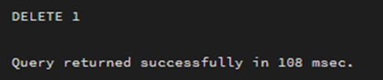

### Q2: Room-wise Student List using STRING_AGG

```sql
SELECT r.room_id, r.capacity, r.occupied,
       STRING_AGG(s.name, ', ') AS students_in_room
FROM rooms r
LEFT JOIN allocation a ON r.room_id = a.room_id
LEFT JOIN students s   ON a.student_id = s.student_id
GROUP BY r.room_id, r.capacity, r.occupied
ORDER BY r.room_id;
```
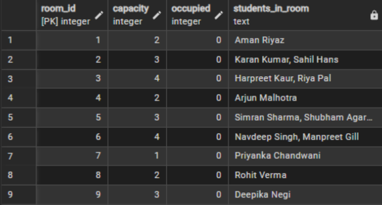
---

## Conclusion

This project demonstrates core database management principles including ER modeling, normalization up to 3NF, triggers, stored functions, views, and comprehensive SQL operations — forming a scalable foundation for a fully deployed Hostel Management application.

---

## References

- [PostgreSQL Docs](https://www.postgresql.org/docs/)
- [pgAdmin Docs](https://www.pgadmin.org/docs/)
- [W3Schools SQL](https://www.w3schools.com/sql/)
- [GeeksforGeeks — PostgreSQL Triggers](https://www.geeksforgeeks.org/postgresql-trigger/)
- [TutorialsPoint — SQL Constraints](https://www.tutorialspoint.com/sql/sql-constraints.htm)
